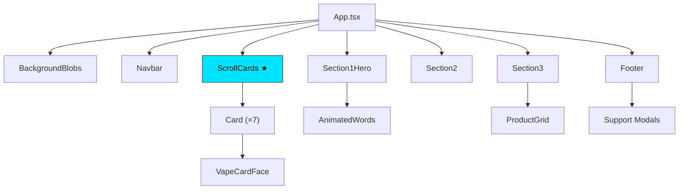

# PRD — evevdigital Vape Store Animasi

> **Project Codename:** `evevdigital-vapestoreanimasi`
> **Version:** 0.1.0
> **Last Updated:** 15 Juni 2026
> **Status:** Production (Deployed on Vercel)
> **Repository:** [github.com/evevdigital-arch/evevdigital-vapestoreanimasi](https://github.com/evevdigital-arch/evevdigital-vapestoreanimasi)
> **Live URL:** [evevdigital-vapestoreanimasi.vercel.app](https://evevdigital-vapestoreanimasi.vercel.app)

---

## 1. Ringkasan Proyek

**evevdigital Vape Store Animasi** adalah sebuah single-page website showcase (landing page) premium untuk toko vape online bernama *evevdigital*. Website ini menampilkan katalog produk vape dari berbagai merek ternama dengan fokus utama pada **animasi interaktif tingkat tinggi** dan **desain visual mewah** bertema gelap (*dark theme*).

Tujuan utama website ini adalah memperlihatkan koleksi produk premium melalui pengalaman visual yang memukau, dengan animasi kartu produk berbasis scroll dan klik yang mengesankan sebagai *hero section* utama.

---

## 2. Target Pengguna

| Segmen | Deskripsi |
|--------|-----------|
| **Pengunjung Kasual** | Pengguna yang mencari informasi produk vape melalui perangkat mobile atau desktop |
| **Pembeli Potensial** | Pengguna yang tertarik membeli dan ingin langsung terhubung via WhatsApp |
| **Enthusiast Vape** | Komunitas vape yang ingin melihat koleksi produk terbaru |

**Platform Target:** Desktop (Chrome, Firefox, Edge, Safari), Mobile (Chrome iOS/Android, Safari iOS)

---

## 3. Tech Stack

| Kategori | Teknologi | Versi |
|----------|-----------|-------|
| **Framework** | React | ^18.3.1 |
| **Build Tool** | Vite | ^5.2.13 |
| **Bahasa** | TypeScript | ^5.4.5 |
| **Animasi** | Framer Motion | ^11.3.0 |
| **Ikon** | Lucide React | ^0.363.0 |
| **Font** | Google Fonts (Inter Tight) | 300–900 weight |
| **Styling** | Vanilla CSS + Inline Styles | — |
| **CSS Preprocessor** | TailwindCSS (partial utility) | ^3.4.4 |
| **Deployment** | Vercel (auto-deploy dari GitHub) | — |

---

## 4. Arsitektur Aplikasi

### 4.1 Struktur Direktori

```
evev-digital/
├── public/
│   ├── images/                    # Gambar produk (16 file .webp & .png)
│   └── robots.txt                 # Anti-scraper/bot configuration
├── src/
│   ├── main.tsx                   # Entry point React
│   ├── App.tsx                    # Root component & layout orchestrator
│   ├── index.css                  # Global styles & reset
│   └── components/
│       ├── BackgroundBlobs.tsx     # Ambient glow effects (fixed background)
│       ├── Navbar.tsx             # Sticky navigation bar + WhatsApp CTA
│       ├── ScrollCards.tsx        # ★ Hero card animation engine (core feature)
│       ├── Section1Hero.tsx       # Hero text, headline, background slideshow
│       ├── Section2.tsx           # Featured Devices section (stats & copy)
│       ├── Section3.tsx           # Product catalog header + feature pills
│       ├── ProductGrid.tsx        # Filterable product grid with categories
│       ├── ScrollIndicator.tsx    # Fixed scroll up/down nav buttons
│       └── Footer.tsx             # Footer, newsletter, support modals
├── index.html                     # HTML entry + anti-scrape scripts + watermark
├── package.json                   # Dependencies & scripts
├── tsconfig.json                  # TypeScript configuration
├── vite.config.ts                 # Vite build configuration
└── tailwind.config.js             # TailwindCSS configuration
```

### 4.2 Diagram Komponen



---

## 5. Fitur Utama

### 5.1 ★ Hero Card Animation (ScrollCards)
**File:** `ScrollCards.tsx` (~425 baris)
**Status:** ✅ Selesai

Fitur inti dan paling kompleks dari seluruh website. Menampilkan 7 kartu produk vape yang memiliki sistem animasi multi-tahap:

#### Tahap Animasi:

| # | Tahap | Deskripsi | Trigger |
|---|-------|-----------|---------|
| 1 | **Intro Reveal** | Kartu utama muncul dari bawah layar, lalu meluncur ke kanan dan menyapu ke kiri untuk membuka semua 7 kartu secara berurutan | Otomatis saat halaman dimuat |
| 2 | **Fan Formation** | 7 kartu tersebar dalam formasi kipas (*fan*) dengan rotasi dan skala yang berbeda | Setelah intro selesai |
| 3 | **Click Carousel** | Klik/tekan kartu mana pun → kartu tersebut bergeser ke posisi tengah, semua kartu lain berputar secara sirkular | User klik/tap |
| 4 | **Scroll Stack** | Saat di-scroll, kartu-kartu menumpuk ke tengah layar | Scroll ke bawah |
| 5 | **Cascade Spread** | Kartu menyebar ke formasi bertingkat (*cascade*) | Scroll lebih lanjut |
| 6 | **Land to Grid** | Kartu terbang dan mendarat tepat di posisi grid produk di bawah | Scroll mendekati section produk |

#### Detail Teknis:

- **7 Produk** dengan data: brand, name, type, gradient, accent color, price, tag, image
- **FAN_SLOTS:** 7 posisi kipas dengan koordinat `x`, `y`, `rotate`, `scale`, dan `z-index`
- **CASCADE:** 7 posisi bertingkat untuk fase scroll menengah
- **Animasi Spring:** `stiffness: 280, damping: 26` untuk efek pegas yang mulus
- **Responsif:** `spreadScale` dan `sizeScale` menyesuaikan otomatis untuk mobile (`vp.w < 768`)
- **Bezier Easing:** Custom cubic bezier `[0.22, 1, 0.36, 1]` untuk pergerakan halus

#### Carousel Logic:
```
currentSlotIndex = ((slotIndex - centerIndex + 3) % 7 + 7) % 7
```
Rumus ini memastikan kartu yang diklik selalu mendapat **slot 3** (posisi tengah), sementara kartu lain bergeser secara sirkular.

#### Rendering Modes:

| Mode | Kondisi | Teknik Animasi |
|------|---------|---------------|
| **Hero Carousel** | `currentProgress < 0.05` | `animate` prop (Framer Motion) |
| **Scroll Driven** | `currentProgress >= 0.05` | `useTransform` + `MotionValue` |
| **Locked** | `currentProgress >= lockProgress` | `position: absolute` |

---

### 5.2 Hero Section (Section1Hero)
**File:** `Section1Hero.tsx` (~173 baris)
**Status:** ✅ Selesai

- **Background Slideshow:** 3 gambar hero vape yang berputar otomatis setiap 5 detik dengan efek fade + blur + scale
- **Animated Headlines:** Teks "Premium Devices, Elevated Experience." muncul kata per kata dengan efek stagger
- **Dot Indicators:** 3 tombol navigasi untuk slideshow
- **Placeholder:** Area kosong (`hero-cards-placeholder`) sebagai anchor posisi untuk ScrollCards
- **Layering:** `zIndex: 2` dengan `pointerEvents: 'none'` agar tidak menghalangi klik pada kartu di atasnya

---

### 5.3 Navigation Bar (Navbar)
**File:** `Navbar.tsx` (~86 baris)
**Status:** ✅ Selesai

- **Fixed Position:** Selalu terlihat di atas layar dengan efek `backdrop-filter: blur(20px)`
- **Logo Hexagonal:** Custom SVG hexagon dengan teks "EV" di dalamnya
- **Brand Wordmark:** "evevdigital" dengan kombinasi font weight 300 dan 800
- **CTA Button:** Tombol "WhatsApp" dengan gradient `#00E5FF → #7C3AED` yang mengarah ke `wa.me/000000000000`
- **Responsif:** Padding menyesuaikan dengan `clamp()`

---

### 5.4 Featured Devices Section (Section2)
**File:** `Section2.tsx` (~116 baris)
**Status:** ✅ Selesai

- **Scroll-Triggered Animation:** Teks dan elemen muncul saat section masuk viewport (`useInView`)
- **Headline:** "Top-tier mods, handpicked for enthusiasts." dengan animasi blur-to-clear per kata
- **Body Copy:** Deskripsi katalog produk
- **Stats Row:** 3 metrik (200+ Products, 50+ Brands, 4.9★ Rating)

---

### 5.5 Product Catalog (Section3 + ProductGrid)
**File:** `Section3.tsx` (~100 baris) + `ProductGrid.tsx` (~223 baris)
**Status:** ✅ Selesai

#### Headline & Feature Pills
- **Headline:** "Your next favourite device." dengan animasi stagger
- **Feature Pills:** 3 badge (Authentic Products, 2-Year Warranty, Free Shipping $50+) dengan ikon Lucide

#### Product Grid
- **12 Produk** dalam 6 kategori: Shop Devices, E-Liquids, Accessories, New Arrivals, Best Sellers
- **Category Filter:** Tombol filter horizontal scrollable dengan animasi transisi layout
- **Product Cards:** Setiap kartu memiliki:
  - Background glow sesuai accent color
  - Gambar produk dengan drop-shadow
  - Brand, nama, tipe, harga
  - Tombol Add to Cart (ikon shopping cart)
  - Efek hover: `y: -8px` lift
- **Event System:** Custom event `filter-category` untuk integrasi dengan Quick Links di Footer
- **Grid Layout:** `repeat(auto-fill, minmax(280px, 1fr))` — responsif otomatis

---

### 5.6 Background Ambient (BackgroundBlobs)
**File:** `BackgroundBlobs.tsx` (~36 baris)
**Status:** ✅ Selesai

4 blob gradient yang tersebar di background (`position: fixed`):
- **Cyan blob** — kiri atas (340×340px, opacity 7%)
- **Purple blob** — kanan atas (280×280px, opacity 7%)
- **Pink blob** — tengah (700×420px, opacity 4%)
- **Cyan blob** — kanan bawah (300×300px, opacity 5%)

Semua diberi `filter: blur()` untuk efek ambient lighting yang halus.

---

### 5.7 Footer
**File:** `Footer.tsx` (~285 baris)
**Status:** ✅ Selesai

Layout 4 kolom (responsif ke 1-2 kolom di mobile):

| Kolom | Konten |
|-------|--------|
| **Brand** | Logo, deskripsi, social links (Facebook, X, Instagram, YouTube) |
| **Quick Links** | Shop Devices, E-Liquids, Accessories, New Arrivals, Best Sellers (scroll + filter ke ProductGrid) |
| **Support** | Contact Us, FAQs, Shipping & Returns, Warranty, Age Verification, Privacy Policy, Terms of Service (buka modal popup) |
| **Newsletter** | Input email + submit button |

#### Support Modals
- **7 modal popup** dengan konten FAQ, kebijakan, dan informasi kontak
- Animasi `scale + opacity + y` dengan backdrop blur
- Tombol close (×) di pojok kanan atas

---

### 5.8 Scroll Indicator
**File:** `ScrollIndicator.tsx` (~43 baris)
**Status:** ✅ Selesai

- 2 tombol fixed di kanan tengah layar (↑ dan ↓)
- Klik untuk scroll satu viewport ke atas/bawah dengan `behavior: 'smooth'`
- Hover effect: warna berubah menjadi `#00E5FF`

---

## 6. Proteksi Anti-Scrape & Anti-Clone

### 6.1 robots.txt
Memblokir semua bot termasuk bot AI:
- `GPTBot`, `ChatGPT-User`, `CCBot`, `anthropic-ai`, `Claude-Web`
- `Google-Extended`, `Bytespider`, `Diffbot`, `Amazonbot`, `PerplexityBot`

### 6.2 Meta Tag
```html
<meta name="robots" content="noindex, nofollow, noarchive, nosnippet">
```

### 6.3 Client-Side Protection
- **Disable Right-Click:** `oncontextmenu="return false"`
- **Disable Drag:** `ondragstart="return false"`
- **Disable Select:** `onselectstart="return false"`
- **Keyboard Blocking:** F12, Ctrl+Shift+I, Ctrl+Shift+J, Ctrl+U
- **CSS Protection:** `user-select: none`, `-webkit-user-drag: none`

---

## 7. Desain Visual

### 7.1 Palet Warna

| Nama | Hex | Penggunaan |
|------|-----|------------|
| **Background** | `#07070E` | Warna latar utama seluruh halaman |
| **Text Primary** | `#F0F0FF` | Teks utama (headline, nama produk) |
| **Text Secondary** | `rgba(240,240,255,0.4)` | Teks deskripsi, label |
| **Accent Cyan** | `#00E5FF` | Warna aksen utama, CTA, highlight |
| **Accent Purple** | `#7C3AED` / `#A78BFA` | Gradient CTA, aksen produk |
| **Accent Pink** | `#F472B6` | Aksen produk tertentu |
| **Accent Green** | `#34D399` | Badge "Free Shipping" |
| **Border Subtle** | `rgba(255,255,255,0.05-0.1)` | Garis pemisah halus |
| **Glass** | `rgba(7,7,14,0.6)` | Efek glassmorphism navbar |

### 7.2 Tipografi

| Elemen | Font | Weight | Size |
|--------|------|--------|------|
| **Headline utama** | Inter Tight | 800 | `clamp(44px, 8vw, 94px)` |
| **Sub-headline** | Inter Tight | 800 | `clamp(36px, 6vw, 60px)` |
| **Body text** | Inter Tight | 400 | `clamp(14px, 3vw, 15px)` |
| **Eyebrow** | Inter Tight | 600 | `11-12px`, tracking `2.5px` |
| **Card brand** | Inter Tight | 800 | `9px`, tracking `2.5px` |
| **Card name** | Inter Tight | 800 | `15px` |
| **Button** | Inter Tight | 700 | `13px` |

### 7.3 Efek Visual

- **Glassmorphism:** Navbar dengan `backdrop-filter: blur(20px)`
- **Gradient Buttons:** CTA WhatsApp `linear-gradient(135deg, #00E5FF, #7C3AED)`
- **Drop Shadows:** Kartu produk `0 20px 60px rgba(0,0,0,0.55)`
- **Glow Effects:** Radial gradient per produk berdasarkan accent color
- **Blur Transitions:** Teks muncul dari blur `10px` ke `0px`

---

## 8. Aset Media

### 8.1 Hero Background (3 gambar)
| File | Format | Ukuran |
|------|--------|--------|
| `hero_vape_1.png` | PNG | ~565 KB |
| `hero_vape_2.png` | PNG | ~556 KB |
| `hero_vape_3.png` | PNG | ~559 KB |

### 8.2 Produk (13 gambar)
| File | Brand | Format | Ukuran |
|------|-------|--------|--------|
| `VOOPOO Argus P1s.webp` | VOOPOO | WebP | ~127 KB |
| `VOOPOO Drag X Plus.webp` | VOOPOO | WebP | ~151 KB |
| `UWELL Caliburn G3.webp` | UWELL | WebP | ~140 KB |
| `VAPORESSO Gen 200 (Ungu).webp` | VAPORESSO | WebP | ~34 KB |
| `GEEKVAPE Aegis L3.webp` | GEEKVAPE | WebP | ~56 KB |
| `VOOPOO Vinci Q.webp` | VOOPOO | WebP | ~55 KB |
| `GEEKVAPE Wenax M1.webp` | GEEKVAPE | WebP | ~43 KB |
| `Naked 100 Lava Flow.webp` | NAKED 100 | WebP | ~71 KB |
| `Vampire Vape Heisenberg.webp` | VAMPIRE VAPE | WebP | ~46 KB |
| `GeekVape Zeus RDA.webp` | GEEKVAPE | WebP | ~47 KB |
| `Hellvape Dead Rabbit 3.webp` | HELLVAPE | WebP | ~38 KB |
| `Nitecore i2 Charger.webp` | NITECORE | WebP | ~62 KB |
| `Cotton Bacon Prime.webp` | COTTON BACON | WebP | ~48 KB |

---

## 9. Responsivitas

### 9.1 Breakpoints

| Range | Klasifikasi | Penyesuaian |
|-------|-------------|-------------|
| `< 768px` | **Mobile** | `spreadScale = vp.w/1000`, `sizeScale = 0.75`, font scaling via `clamp()` |
| `≥ 768px` | **Desktop** | Full-size cards, full fan spread, grid 2-4 kolom |

### 9.2 Penyesuaian Mobile

- **Card Size:** 220px × 220px → dikali `sizeScale: 0.75` = 165px visual
- **Fan Spread:** Dikali `spreadScale` (contoh: 375px / 1000 = 0.375)
- **Product Grid:** `minmax(280px, 1fr)` → 1 kolom di layar kecil
- **Category Filter:** Horizontal scroll dengan `overflow-x: auto`
- **Typography:** Semua headline menggunakan `clamp()` untuk scaling proporsional
- **Navbar:** Padding menyesuaikan dengan `clamp(16px, 5vw, 40px)`

---

## 10. Data Produk

### 10.1 Produk Hero (7 item — ScrollCards)

| # | Brand | Produk | Tipe | Harga | Tag | Accent |
|---|-------|--------|------|-------|-----|--------|
| 1 | VOOPOO | Argus P1s | POD SYSTEM | $29.99 | BESTSELLER | `#00E5FF` |
| 2 | VOOPOO | Drag X Plus | BOX MOD | $49.99 | POWERFUL | `#38BDF8` |
| 3 | UWELL | Caliburn G3 | AIO DEVICE | $35.99 | COMPACT | `#F472B6` |
| 4 | VAPORESSO | Gen 200 | BOX MOD | $64.99 | FLAGSHIP | `#A78BFA` |
| 5 | GEEKVAPE | Aegis L3 | REGULATED MOD | $54.99 | WATERPROOF | `#60A5FA` |
| 6 | VOOPOO | Vinci Q | POD DEVICE | $24.99 | PORTABLE | `#C084FC` |
| 7 | GEEKVAPE | Wenax M1 | STARTER KIT | $19.99 | BEGINNER | `#34D399` |

### 10.2 Produk Tambahan (5 item — ProductGrid only)

| # | Brand | Produk | Tipe | Kategori | Harga |
|---|-------|--------|------|----------|-------|
| 8 | NAKED 100 | Lava Flow | FREEBASE 60ML | E-Liquids | $19.99 |
| 9 | VAMPIRE VAPE | Heisenberg | SALT NIC 30ML | E-Liquids | $15.99 |
| 10 | GEEKVAPE | Zeus RDA | REBUILDABLE | Shop Devices | $29.99 |
| 11 | HELLVAPE | Dead Rabbit 3 | REBUILDABLE | New Arrivals | $34.99 |
| 12 | NITECORE | i2 Charger | BATTERY CHARGER | Accessories | $14.99 |
| 13 | COTTON BACON | Prime | WICKING COTTON | Accessories | $5.99 |

---

## 11. Integrasi & Link Eksternal

| Tujuan | URL | Metode |
|--------|-----|--------|
| **WhatsApp** | `https://wa.me/000000000000` | Tombol CTA navbar (nomor dummy) |
| **Facebook** | `https://facebook.com/evevdigital` | Ikon sosial di footer |
| **X (Twitter)** | `https://x.com/evevdigital` | Ikon sosial di footer |
| **Instagram** | `https://instagram.com/evevdigital` | Ikon sosial di footer |
| **YouTube** | `https://youtube.com/@evevdigital` | Ikon sosial di footer |
| **GitHub** | `https://github.com/evevdigital-arch` | Watermark link |
| **Google Fonts** | `fonts.googleapis.com` | Preconnect + CSS import |

---

## 12. Branding & Watermark

Website ini menyertakan **watermark evevdigital** yang muncul secara permanen:

- **Posisi:** Fixed di pojok kanan bawah layar
- **Tampilan:** Glassmorphism badge dengan opacity 30%
- **Hover Effect:** Opacity → 100%, background putih, shadow
- **Link:** Mengarah ke GitHub evevdigital-arch
- **z-index:** 9999 (selalu di atas)

---

## 13. Performance & Optimisasi

| Aspek | Implementasi |
|-------|-------------|
| **Image Format** | WebP untuk produk (kompresi tinggi), PNG untuk hero |
| **Font Loading** | `preconnect` ke Google Fonts + `display=swap` |
| **Code Splitting** | Vite automatic chunk splitting |
| **Animation Performance** | Framer Motion `useTransform` untuk scroll-driven (GPU-accelerated) |
| **Lazy Rendering** | `useInView` dengan `once: true` untuk animasi section |
| **Build Tool** | Vite (ESBuild + Rollup) untuk build cepat |

---

## 14. Deployment

| Aspek | Detail |
|-------|--------|
| **Platform** | Vercel |
| **Metode** | Auto-deploy dari branch `master` di GitHub |
| **Repository** | `evevdigital-arch/evevdigital-vapestoreanimasi` |
| **Build Command** | `tsc && vite build` |
| **Output Directory** | `dist/` |
| **Domain** | `evevdigital-vapestoreanimasi.vercel.app` |

---

## 15. Known Limitations & Catatan

> [!WARNING]
> ### Limitasi yang Diketahui
> - **Nomor WhatsApp:** Masih menggunakan nomor dummy (`000000000000`), perlu diganti dengan nomor asli
> - **Tidak ada backend:** Semua data produk hardcoded di frontend
> - **Tidak ada keranjang belanja:** Tombol cart hanya visual, belum fungsional
> - **Newsletter:** Form email belum terintegrasi dengan layanan email marketing
> - **Social Media:** Link sosial mengarah ke URL placeholder
> - **Touch Swipe:** Efek hover-saat-digeser (swipe-over) tidak bisa diimplementasikan di browser mobile karena limitasi teknis bawaan browser

> [!NOTE]
> ### Catatan Teknis
> - Anti-scrape protection bersifat client-side only dan bisa di-bypass oleh pengguna teknis
> - `robots.txt` bersifat advisory (bot nakal bisa mengabaikannya)
> - Animasi scroll-driven menggunakan threshold `currentProgress < 0.05` untuk kompatibilitas mobile
> - Wrapper div menggunakan `pointerEvents: 'none'` dengan child `pointerEvents: 'auto'` untuk memungkinkan klik menembus ke kartu

---

## 16. Roadmap (Pengembangan Selanjutnya)

| Prioritas | Fitur | Deskripsi |
|-----------|-------|-----------|
| 🔴 Tinggi | Nomor WhatsApp asli | Ganti nomor dummy dengan nomor bisnis |
| 🔴 Tinggi | Domain custom | Hubungkan domain `.com` atau `.id` |
| 🟡 Sedang | Backend API | Integrasikan dengan CMS untuk manajemen produk |
| 🟡 Sedang | Keranjang belanja | Implementasi cart + checkout flow |
| 🟡 Sedang | Optimisasi gambar hero | Konversi hero PNG ke WebP (hemat ~60% ukuran) |
| 🟢 Rendah | Newsletter integration | Hubungkan form email ke Mailchimp/SendGrid |
| 🟢 Rendah | Analytics | Pasang Google Analytics / Vercel Analytics |
| 🟢 Rendah | PWA Support | Service worker untuk offline access |

---

*Dokumen ini dibuat otomatis berdasarkan analisis mendalam terhadap seluruh source code proyek evevdigital Vape Store Animasi.*
